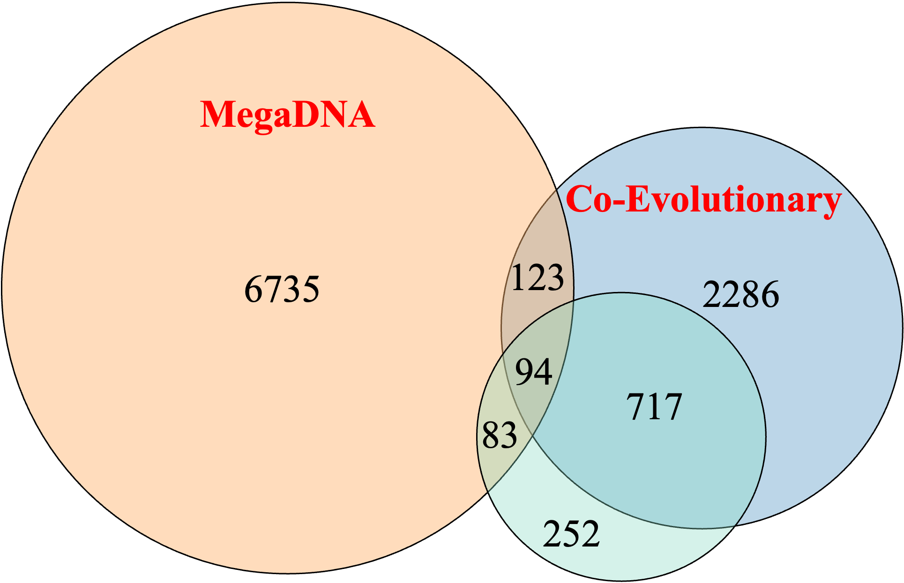

# EvoMega(Co-Evolutionary+MegaDNA)

## Predicting bacteriophage transcription factor binding sites based on evolutionary relationships and large language model.


### Table of Contents
- [Introduction](#introduction)
- [Installation](#installation)
    - [Prerequisites](#prerequisites)
    - [Create EvoMega Environment](#create-evomega-environment)
    - [Install Dependencies and Tools](#install-dependencies-and-tools)
    - [Download and Set Up Databases and Models](#download-and-set-up-databases-and-models)
    - [Install MEME Suite](#install-meme-suite)
    - [Configure Environment Variables](#configure-environment-variables)
- [Usage](#usage)
    - [Running the Motif Analyzer](#running-the-motif-analyzer)
    - [Example](#example)
- [Output Explanation](#output-explanation)
- [Troubleshooting](#troubleshooting)
- [License](#license)
- [Contact](#contact)
- [Database Storage](#database-storage)

---

## Introduction

EvoMega is a tool designed to predict transcription factor binding sites in bacteriophages. By analyzing genomic data, it identifies key motifs that are crucial for understanding phage biology and interactions with host organisms.

## Installation

Follow the steps below to install EvoMega. The installation process has been streamlined to simplify operations by grouping related tasks together.

### Prerequisites

Ensure that your system meets the following requirements:

- Operating System: Linux-based systems are recommended.
- Conda: For managing packages and environments (optional but recommended).
- Python: Version 3.6 or higher.

### Create EvoMega Environment

1. Install Conda (if not already installed):

   If you don't have Conda installed, follow the official installation guide.

2. Create a Conda environment named EvoMega with Python version 3.8.10:

   ``` bash
   conda create -n EvoMega python=3.8.10
   ```

3. Activate the EvoMega environment:

   ``` bash
   conda activate EvoMega
   ```

### Install Dependencies and Tools

1. Update Package Lists and Install Essential Build Tools:

   ``` bash
   sudo apt update
   sudo apt install -y build-essential gcc g++ make zlib1g-dev libbz2-dev liblzma-dev
   ```

2. Install Compression Tools:

   Choose either 7za or unzip based on your preference.

   - Using 7za:

     ``` bash
     sudo apt install -y p7zip-full
     ```

   Or using unzip:

   ``` bash
   sudo apt install -y unzip
   ```

3. Install hmmer Using Conda:

   ``` bash
   conda install -c bioconda hmmer
   ```

4. Install Python Dependencies:

   Ensure that a requirements.txt file exists in the project root directory. Then run:

   ``` bash
   pip install -r requirements.txt
   ```

### Download and Set Up Databases and Models

1. Clone EvoMega Repository:

   (Assuming the code is hosted on GitHub. Replace the URL with the actual repository link.)

   ``` bash
   git clone https://github.com/yourusername/EvoMega.git
   cd EvoMega
   ```

2. Download EvoMega Databases:

   ``` bash
   wget --save-cookies /tmp/cookies.txt --no-check-certificate "https://drive.usercontent.google.com/download?id=1569KsNmwhVuVNduQNfQ2_KLWx1v_fqGo&export=download&authuser=0&confirm=t&uuid=f30f18ad-3133-4dc9-bed3-cd95a448f69f&at=APvzH3rXKE6IjUztvq4HwPbot34Y:1734682290410" -O exclude_GPD_find_key_motif.zip
   wget --save-cookies /tmp/cookies.txt --no-check-certificate "https://drive.usercontent.google.com/download?id=1FQyELLO9tk6h6uF7mBxORmkJ8FTc5ib5&export=download&authuser=0&confirm=t&uuid=45b4aea8-b4ff-45fa-89a2-bb39b1dd24fe&at=APvzH3pjYOfsjc_1FQRUKXXu0t4I:1735826436323" -O tfbs_model.joblib
   rm -f /tmp/cookies.txt
   ```

3. Extract the Downloaded Database:

   Using 7za:

   ``` bash
   7za x exclude_GPD_find_key_motif.zip -mmt=on
   ```  

   Or using unzip:

   ``` bash
   unzip exclude_GPD_find_key_motif.zip
   ```

4. Download Additional Models and Databases:

   - MegaDNA Model:

     ``` bash
     wget https://huggingface.co/lingxusb/megaDNA_updated/resolve/main/megaDNA_145M.pt -P scripts/model/
     ```

   - Pfam-A.hmm:

     ``` bash
     wget ftp://ftp.ebi.ac.uk/pub/databases/Pfam/releases/Pfam35.0/Pfam-A.hmm.gz
     gzip -d Pfam-A.hmm.gz
     mv Pfam-A.hmm scripts/Pfam/
     ```

### Install MEME Suite

The MEME Suite is essential for motif analysis. Follow these steps to install it:

1. Download MEME Suite:

   ``` bash
   wget https://meme-suite.org/meme/meme-software/5.5.7/meme-5.5.7.tar.gz
   ```

2. Extract the Archive and Navigate to the Directory:

   ``` bash
   tar -xzvf meme-5.5.7.tar.gz
   cd meme-5.5.7
   ```

3. Configure, Compile, and Install MEME Suite:

   ``` bash
   ./configure
   make
   sudo make install
   ```

### Configure Environment Variables

1. Add MEME Suite Binaries to Your PATH:

   ``` bash
   echo 'export PATH=$PATH:/usr/local/meme/bin' >> ~/.bashrc
   source ~/.bashrc
   ```

2. Verify MEME Suite Installation:

   ``` bash
   meme --version
   ```

   You should see the installed version of MEME Suite. If not, revisit the Install MEME Suite section.

### Summary of Directory Structure

Ensure that the required databases and models are placed in the appropriate directories within your project:

```bash
EvoMega/
├── scripts/
│   ├── analysis_meme_file.py
│   ├── feature.py
│   ├── gene_interaction.py
│   ├── key_function.py
│   ├── model/
│   │   ├── megaDNA_phage_145M.pt
│   │   └── tfbs_model.joblib
│   ├── model_scoring.py
│   ├── motif_analysis.py
│   ├── motif_analyzer.py
│   ├── MPI_DFI.py
│   ├── one_key_analysis.py
│   ├── Pfam/
│   │   ├── Pfam-A.hmm
├── exclude_GPD_find_key_motif/  # Extracted database
├── requirements.txt
└── README.md
```


## Usage

### Running the Motif Analyzer

To use the motif analyzer, execute the following command:

   ``` bash
   python scripts/motif_analyzer.py -i INPUT_FILE -o OUTPUT_PATH
   ```

Parameters:

- -i or --input_file: Path to the input file (e.g., GenBank file).
- -o or --output_path: Directory where the output will be saved.

### Example

Here is an example of how to run the motif analyzer with a sample input file:

   ``` bash
   python scripts/motif_analyzer.py -i NC_001416.gbk -o scripts/output
   ```

This command analyzes the NC_002371.gbk GenBank file and saves the results in the scripts/output directory.

## Output Explanation

After running EvoMega, the output directory will have the following structure:
scripts/output/
```bash
├── interaction
│   └── batch_figure
│       ├── NC_001416
│       │   ├── contacts_round_1_with_hth_interactions.png
│       │   ├── contacts_round_2_with_hth_interactions.png
│       │   ├── extracted_sequences.fasta
│       │   ├── hmmscan_output.txt
│       │   ├── hth_interactions_round_1.csv
│       │   ├── hth_interactions_round_2.csv
│       │   └── updated_sequences
│       │       ├── updated_extracted_sequences_round_1.fasta
│       │       ├── updated_extracted_sequences_round_2.fasta
├── NC_001416
│   ├── extend_meme_10.csv
│   ├── motif_meme
│   │   ├── fimo_results
│   │   │   ├── fimo.txt
│   │   │   └── tomtom_results
│   │   │       ├── combined_motifs.meme
│   │   ├── final_motif.meme
│   │   └── non_redundant.meme
│   ├── motif_trends.png
│   ├── NC_001416.csv
│   ├── NC_001416_motif_metrix.csv
│   ├── rank_list.csv
│   └── results_df.csv
```


### Detailed Explanation:

- `interaction/batch_figure/NC_001416`:
  - `contacts_round_1_with_hth_interactions.png`: Visualization of gene interactions after the first round.
  - `contacts_round_2_with_hth_interactions.png`: Visualization of gene interactions after the second round.
  - `extracted_sequences.fasta`: FASTA file containing extracted gene sequences.
  - `hmmscan_output.txt`: Output from the HMMER scan.
  - `hth_interactions_round_1.csv`: CSV file detailing helix-turn-helix (HTH) interactions from round 1.
  - `hth_interactions_round_2.csv`: CSV file detailing HTH interactions from round 2.
  - `updated_sequences/`: Contains updated sequences after the rounds.
    - `updated_extracted_sequences_round_1.fasta`: Updated sequences after round 1.
    - `updated_extracted_sequences_round_2.fasta`: Updated sequences after round 2.

- `NC_001416`:
  - `extend_meme_10.csv`: Extended MEME analysis results.
  - `motif_meme/`: Directory containing motif analysis results.
    - `fimo_results/fimo.txt`: Results from the FIMO tool identifying motif occurrences.
    - `final_motif.meme`: Final set of motifs after analysis.
    - `non_redundant.meme`: Non-redundant motifs.
  - `motif_trends.png`: Visualization of motif trends.
  - `NC_001416.csv`: General results for NC_001416.
  - `NC_001416_motif_metrix.csv`: Comprehensive scoring matrix.
  - `rank_list.csv`: Ranked list of motifs based on scoring.

## Troubleshooting

- **MEME Suite Not Found**:  
  Ensure that MEME Suite is correctly installed and that the path is added to your PATH environment variable. You can verify by running:

   ``` bash
   meme --version
   ```

  If the command is not found, revisit the Install MEME Suite section.

- **Permission Issues**:  
  If you encounter permission errors during installation, ensure you have the necessary rights or use `sudo` where appropriate.

- **Missing Dependencies**:  
  Make sure all required dependencies are installed. Refer to the Install Dependencies and Tools section.

- **Conda Environment Issues**:  
  If you have trouble activating the Conda environment, ensure that Conda is properly installed and initialized. You can initialize Conda with:

   ``` bash
   conda init
   ```  
   ``` bash
   source ~/.bashrc
   ```

- **Download Failures**:  
  If downloads from Google Drive fail, ensure that you have a stable internet connection and that the download links are accessible.

## License

This project is licensed under the [MIT License](LICENSE).

## Contact

For any questions or support, please contact 1025387313hzq@gmail.com.

